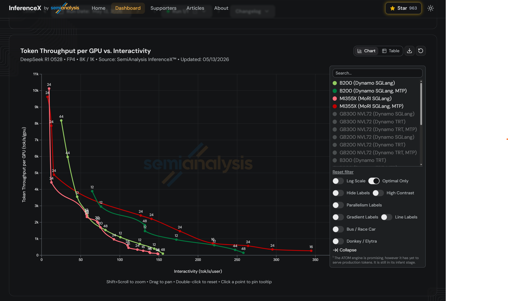
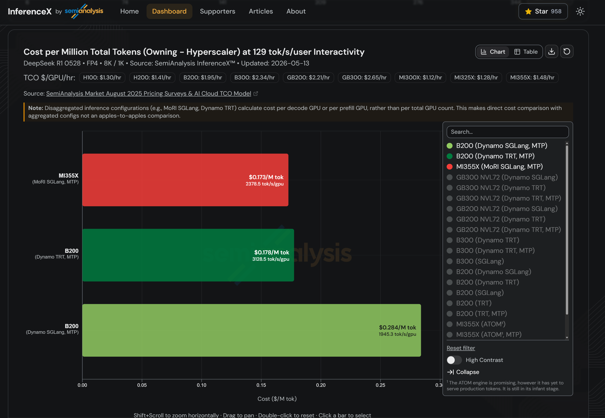
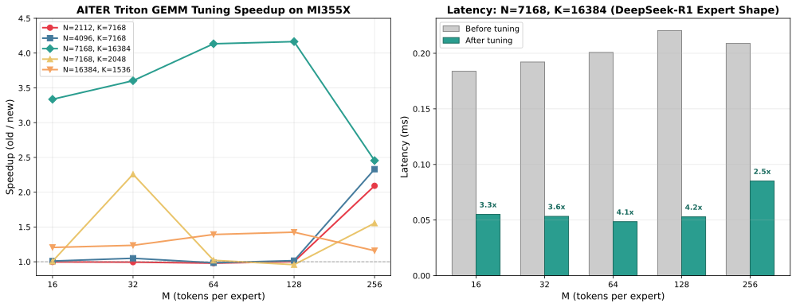
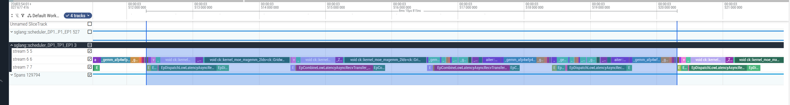

# Win on TCO: How AMD Instinct™ MI355X Achieves Cost-Competitive Distributed Inference Through MoRI

The SGLang and AMD Team | May 2026

---

The SGLang team has worked closely with AMD to unlock competitive Total Cost of Ownership (TCO) for large-scale DeepSeek-R1 disaggregated inference on AMD Instinct™ MI355X GPUs. Building on [SGLang](https://github.com/sgl-project/sglang)'s serving framework and AMD's [MoRI](https://github.com/ROCm/mori) communication library, we demonstrate that AMD achieves competitive — and at key operating points, superior — TCO compared to NVIDIA B200 running Dynamo + TRT-LLM. These results are validated by [InferenceX](https://github.com/SemiAnalysisAI/InferenceX), SemiAnalysis's open-source continuous benchmark platform that tests across hundreds of GPUs with a [live dashboard](https://inferencex.com).

This post describes what we achieve, how we achieve it, and our plans for the road ahead.

**TL;DR**
- At **129 tok/s/user** interactivity, AMD Instinct™ MI355X delivers **$0.173** per million tokens — **2.9% lower cost** than B200 TRT-LLM and **39% lower cost** than B200 SGLang.
- **2,378 tok/s/GPU** on 24 GPUs — **1.22× higher throughput per GPU** than B200 SGLang (48 GPUs).
- Full-stack optimizations: AITER GEMM tuning, MoRI quantized all-to-all (up to **2.56× bandwidth reduction**), MoRI-IO KV cache backend (**~10% higher throughput** than Mooncake), Two-Batch Overlap with SDMA, Specv2 MTP on ROCm, and CPU streaming optimization.

## Results at a Glance

At the typical operating point representative of production coding assistants and interactive chatbots — e.g. **129 tok/s/user** interactivity — we observe the following:

- **AMD Instinct™ MI355X (MoRI SGLang MTP)**: **$0.173** per million tokens, **2,378** tok/s/GPU (24 GPUs)
- **NVIDIA B200 (Dynamo TRT-LLM MTP)**: $0.178 per million tokens, **3,128** tok/s/GPU (28 GPUs)
- **NVIDIA B200 (Dynamo SGLang MTP)**: $0.284 per million tokens, **1,945** tok/s/GPU (48 GPUs)

AMD Instinct™ MI355X delivers **2.9% lower cost** than B200 TRT-LLM, **39% lower cost** than B200 SGLang, and **1.22× higher throughput** per GPU than B200 SGLang — winning on both cost and performance simultaneously.

## Key Optimizations

We achieved these results through a series of full-stack optimizations spanning compute kernels, communication, and serving infrastructure. The following sections walk through each in detail.

### AITER GEMM Tuning for MoE in Distributed Scenarios

MoE GEMM performance is shape-dependent, and the dominant shapes differ by serving scenario. In **low-latency pure TP** deployments, each GPU processes all experts with small batch sizes, producing tall-skinny GEMMs. In **high-throughput DP+EP** deployments, tokens are distributed across expert-parallel ranks, yielding different N/K dimensions per expert. We provide separate tuning configurations for each scenario to maximize MI355X utilization.

[AITER](https://github.com/ROCm/aiter) optimizes both the key GEMM and FusedMoE compute kernels on MI355X:

**Triton blockscale GEMM tuning** — the A8W8 blockscale GEMM path uses per-shape tuned configurations for MI355X (gfx950). Key shapes like (N=7168, K=16384) and (N=16384, K=1536) — matching DeepSeek-R1's expert dimensions — are tuned with optimized block sizes, warp counts, pipeline stages, and k-splitting parameters. Special-case tuning for ultra-small M values (≤8, ≤256) targets the small per-expert batches typical in EP decode.

**FlyDSL for FusedMoE** — traditionally, FusedMoE kernels on AMD relied solely on Composable Kernel (CK). FlyDSL (Flexible Layout Python DSL) — a Python DSL backed by an MLIR stack for authoring GPU kernels with explicit layouts and tiling — is now integrated into AITER as a competitive FusedMoE kernel path for mixed-precision MoE (e.g., A4W4), enabling rapid exploration of kernel configurations beyond what hand-tuned CK templates cover. At a typical concurrency of 512, we gained up to **1.6× latency reduction** for this part.

### MoRI Quantized All-to-All for Expert Parallelism

#### Hybrid FP4/FP8 quantized all-to-all

We built hybrid quantized all-to-all in a series of PRs: FP4 dispatch + FP8 combine direct cast ([#19757](https://github.com/sgl-project/sglang/pull/19757)) introduced MXFP4 dispatch to reduce communication latency; FP8 blockwise combine ([#24879](https://github.com/sgl-project/sglang/pull/24879)) added fine-grained FP8 blockwise quantization for the combine path, achieving ~2% higher accuracy than direct-cast FP8; and auto-select dispatch dtype ([#21040](https://github.com/sgl-project/sglang/pull/21040)) made MoRI automatically detect the correct dispatch quantization type from the model's MoE weight dtype, eliminating manual env var configuration.

In expert-parallel MoE inference, each token must be dispatched to the top-k selected experts via dispatch and combine communication primitives. For DeepSeek-R1 with a hidden dimension of 7,168 and top-8 expert routing, BF16 communication volume is significantly higher than that of FP8 and FP4 quantized communication.

The key insight is that communication quantization should match the model's weight precision. If weights are already MXFP4, dispatch precision does not need to exceed FP4. Similarly, expert outputs (combine phase) tolerate FP8 quantization without meaningful accuracy loss.

MoRI supports multi-level quantized communication:

*MoRI-EP combine kernel micro-benchmark on AMD Instinct™ MI355X (EP8, BF16 input, max_tokens=4096, hidden_dim=7168, scale_dim=56, zero-copy=0, dispatch=128/16, combine=128/16, 10-round average, combine latency only):*

| Case                                | Path                      | Combine Latency |
|-------------------------------------|---------------------------|-----------------|
| Normal (no-scale)                   | fp8_blockwise specialized | **~736 µs**     |
| Uniform[−1024, 1024] (scale-active) | fp8_blockwise specialized | **~770 µs**     |
| Force-scale-active                  | fp8_blockwise specialized | **~769 µs**     |
| Reference                           | bf16 no-quant             | ~907 µs         |
| Reference                           | fp8_direct_cast           | ~526 µs         |

For MXFP4 models such as `amd/DeepSeek-R1-0528-MXFP4-v2`, the system uses **FP4 dispatch + FP8 combine**, achieving a **2.56× overall round-trip bandwidth reduction** (from 28,672 to 11,200 bytes per token).

**Blockwise quantization** preserves accuracy through fine-grained scaling. By default, FP8 blockwise uses per-128-element FP32 scale factors, achieving a good tradeoff between performance and accuracy.

The quantization mode is auto-detected from the model's weight format and can be overridden via `SGLANG_MORI_DISPATCH_DTYPE` and `SGLANG_MORI_COMBINE_DTYPE` environment variables.

#### Adaptive kernel selection

We added inter-node kernel type switching ([#18437](https://github.com/sgl-project/sglang/pull/18437)) to MoRI-EP — the new `InterNodeV1LL` kernel delivers **1.52× dispatch** and **1.82× combine** speedup over the original `InterNodeV1` when the number of tokens per rank is below 256.

MoRI dynamically selects the optimal communication kernel based on workload characteristics:

| Kernel | Condition | Optimized For |
|--------|-----------|---------------|
| `IntraNode` | Single-node (≤8 GPUs) | Shared memory / P2P |
| `InterNodeV1` | Multi-node, >256 tokens/rank | High throughput, staged RDMA |
| `InterNodeV1LL` | Multi-node, ≤256 tokens/rank | Low latency |
| `AsyncLL` | SDMA-enabled paths | Fully async send/recv split |

The switching threshold is automatically configured based on the decode batch size, ensuring that prefill phases (large batches) use high-throughput kernels while decode phases (smaller per-rank batches) use low-latency kernels.

### MoRI-IO KV Cache Backend

In [#22665](https://github.com/sgl-project/sglang/pull/22665) we overhauled MORI-IO with state transfer support (Mamba, SWA, NSA), a lock-free inline transfer model that eliminates worker-thread dispatch, and high-concurrency fixes for robust operation under thousands of concurrent requests.

#### Inline transfer for high-concurrency KV migration

- **Lock-free inline execution.** Transfer requests execute directly in the caller path instead of being dispatched to worker threads. Transfer plans are precomputed once and reused across all layers, eliminating per-layer scheduling overhead and reducing lock contention.
- **Robust at scale.** Default RDMA parallelism is increased to **4** queue pairs and **4** workers per transfer, with thread-safe connection reuse that prevents port exhaustion under thousands of concurrent requests.

#### Broader model coverage

Beyond standard MLA-based KV cache, MoRI adds state transfer support for hybrid architectures — Mamba (SSM state), SWA, and NSA — enabling disaggregated serving for models like Qwen3.5-397B-A17B. It also handles TP-mismatch scenarios where prefill and decode use different tensor-parallel degrees, correctly mapping replicated attention heads across ranks.

*MoRI-IO benchmark on AMD Instinct™ MI355X (8 GPUs/node, 8× AMD Pensando Pollara 400 AI-NIC, DeepSeek-R1 671B FP8, TP=8, 2048 prompts, ISL=8192, OSL=1024):*

| Metric                  | MoRI-IO          | Mooncake         |
|-------------------------|------------------|------------------|
| Request throughput      | **7.49 req/s**   | 6.80 req/s       |
| Input token throughput  | **31,111 tok/s** | 28,257 tok/s     |
| Output token throughput | **3,775 tok/s**  | 3,428 tok/s      |
| Total token throughput  | **34,886 tok/s** | 31,685 tok/s     |

MoRI-IO delivers **~10% higher throughput** than Mooncake across all metrics, with comparable single-request latency (~7 ms TPOT) and high accuracy (GSM8K 5-shot: **0.970**).

### Two-Batch Overlap (TBO) with SDMA

TBO was built across three PRs: two-batch overlapping for MoRI EP ([#19216](https://github.com/sgl-project/sglang/pull/19216)) introduced the core dual-stream pipeline with MoRI's async API, delivering up to **+25% throughput** at large batch sizes; SDMA path for MoRI EP ([#23929](https://github.com/sgl-project/sglang/pull/23929)) enabled AMD's System DMA engines for zero-compute-overhead data movement via split send/recv; and dual-stream MoE on ROCm ([#24005](https://github.com/sgl-project/sglang/pull/24005)) activated the shared-expert overlap stream on the ROCm path, reducing mean TPOT from 97 ms to 83 ms.

Even with **2–4× bandwidth reduction** from quantization, all-to-all communication remains significant. Two-Batch Overlap (TBO) hides this latency by interleaving communication and compute across two micro-batches:

1. **MicroBatch A dispatch** sends quantized tokens over the network on a dedicated communication stream
2. While network transfer is in flight, **MicroBatch B attention** computes on the main compute stream
3. **MicroBatch A** arrives; MoE GEMM runs
4. **MicroBatch A combine** sends results back on the communication stream
5. Meanwhile, **MicroBatch B dispatch** begins

The dispatch and combine operations are split into A/B phases — `dispatch_a` for local quantization on the compute stream, `dispatch_b` for network transfer on the communication stream. A `CommStreamPool` manages dedicated streams, and events synchronize handoff points.

When SDMA is enabled (`MORI_ENABLE_SDMA=true`), data transfers run on AMD's dedicated System DMA engines that move data between GPU memory and network interfaces without consuming any compute units. This achieves true zero-compute-overhead communication, keeping every compute unit available for GEMM operations throughout the pipeline.

### Specv2 MTP on ROCm

We enabled Specv2 on ROCm by fixing draft-to-verify stream synchronization ([#21940](https://github.com/sgl-project/sglang/pull/21940)) — recording a CUDA event after draft GPU work and waiting on it in the verify plan stream, ensuring correct data handoff without over-synchronizing the entire main stream.

DeepSeek supports Multi-Token Prediction (MTP) via the NEXTN speculative decoding algorithm, predicting **2** additional tokens per step. MTP creates a compounding effect with quantized communication: it increases the decode batch size by **3×** (original + 2 speculative tokens), improving all-to-all bandwidth utilization at larger batch sizes, while FP4/FP8 quantization keeps per-token communication cost low despite the larger batches.

SGLang's **Specv2** pipeline overlaps the draft and verify phases by running verification preparation on a separate GPU stream while the draft model executes. This hides scheduling overhead and is now the default path in SGLang. We enabled it on ROCm with AMD-specific attention backends (AITER) for draft CUDA graph capture and a targeted stream synchronization fix that ensures correct draft-to-verify data handoff.

With our optimization, MTP on AMD Instinct™ MI355X runs with full overlap scheduling, combining multi-token prediction throughput gains with hidden scheduling latency.

### CPU Streaming Optimization

In [#22658](https://github.com/sgl-project/sglang/pull/22658) we optimized the decode-side CPU streaming path with two changes: batch notification (grouping asyncio event wakeups instead of per-request `event.set()`) and an SSE fast path (replacing Pydantic serialization with direct `orjson.dumps()` on the hot streaming yield points), achieving **+20% output throughput** and **-16% TPOT** at 2,048 concurrency.

Under high-concurrency PD disaggregation (e.g., 2,048 concurrent requests), the GPU pipeline is no longer the bottleneck — the decode-side CPU path becomes the limiter. We optimized the asyncio notification batching and SSE serialization hot path in SGLang's tokenizer manager and API layer, reducing CPU overhead without affecting inter-token latency.

## Looking Ahead

The next frontier for distributed inference is shifting from chat-style workloads toward **agentic applications** — tools like Claude Code, Codex, and Cursor that drive deep multi-turn, tool-augmented conversations with long context windows (up to 1M tokens), extremely high KV cache reuse, and rapid-fire request bursts from parallel subagent spawning. InferenceX is developing an agentic coding benchmark to capture these patterns, moving toward a true end-to-end system benchmark. Our future optimizations on AMD Instinct™ MI355X will target this workload by leveraging more advanced asynchronous parallelism strategies such as DWDP (Disaggregated Wide Data Parallelism), as well as exploiting ROCm platform-specific capabilities like SDMA for fully asynchronous, zero-compute-overhead data movement — ultimately pushing disaggregated MoE serving to match the burst-traffic, cache-heavy demands of agentic inference at scale.

## Summary

This post demonstrates how AMD Instinct™ MI355X with MoRI on SGLang achieves competitive TCO for large-scale DeepSeek disaggregated inference. At 129 tok/s/user interactivity, AMD Instinct™ MI355X delivers inference at **$0.173** per million tokens with **2,378** tok/s/GPU — **2.9% lower cost** than B200 TRT-LLM and **1.22× higher throughput** per GPU than B200 SGLang.

This result is driven by a full-stack optimization effort across compute, communication, and serving:

- **AITER GEMM tuning + FlyDSL FusedMoE** — platform-tuned compute kernels for both TP and DP+EP scenarios on MI355X
- **MoRI quantized all-to-all** — hybrid FP4/FP8 communication with adaptive kernel selection, reducing round-trip bandwidth by up to **2.56×**
- **MoRI-IO KV cache backend** — lock-free inline transfer with high-concurrency RDMA, delivering ~10% higher throughput than Mooncake
- **Two-Batch Overlap with SDMA** — hiding communication latency behind compute using AMD's dedicated DMA engines
- **Specv2 MTP on ROCm** — full overlap scheduling for multi-token prediction, increasing effective decode batch size by 3×
- **CPU streaming optimization** — asyncio batching and SSE fast path, unlocking +20% output throughput at 2,048 concurrency

Combined with AMD Instinct™ MI355X's hardware cost advantage (**$1.48**/hr/GPU vs $1.95 for B200), these software optimizations translate competitive throughput into a TCO win.

The results are open-source and continuously validated via [InferenceX](https://inferencex.semianalysis.com/).

## Acknowledgements

We would like to thank the AMD ROCm team for their close collaboration on MoRI, AITER, and ROCm platform enablement, and the SemiAnalysis team for building and maintaining the InferenceX benchmark platform. This work was made possible by the joint effort of SGLang and AMD contributors working together on compute optimization, communication libraries, and serving infrastructure.

## References

[1] [SGLang: Fast Serving Framework for Large Language and Vision Models](https://github.com/sgl-project/sglang)

[2] [MoRI: Modular RDMA Interface for AMD GPUs](https://github.com/ROCm/mori)

[3] [AITER: AMD Instinct Tensor Engine Runtime](https://github.com/ROCm/aiter)

[4] [InferenceX: Open-Source Continuous Inference Benchmark](https://github.com/SemiAnalysisAI/InferenceX)

[5] [InferenceXv2: NVIDIA Blackwell Vs AMD vs Hopper](https://semianalysis.com) | SemiAnalysis

[6] [Practical, Fault-Robust Distributed Inference for DeepSeek on AMD MI300X](https://rocm.blogs.amd.com/software-tools-optimization/wide-ep-deepseek/README.html) | AMD ROCm Blog

[7] [DeepSeek-V3 Technical Report](https://arxiv.org/abs/2412.19437) | DeepSeek-AI

## Endnotes

[#1] System configuration for AMD Instinct™ MI355X benchmark: 8× AMD Instinct™ MI355X per node, AMD EPYC™ processors, AMD AINIC (ionic) RDMA with 8 NICs per node, SGLang v0.5.10+, AITER, MoRI, ROCm 7.2, model: amd/DeepSeek-R1-0528-MXFP4-v2.

[#2] TCO estimates sourced from SemiAnalysis InferenceXv2 analysis. Hardware costs reflect hyperscaler pricing models.

[#3] Performance results measured by SemiAnalysis InferenceX continuous benchmark platform. Benchmark methodology and raw data available at https://github.com/SemiAnalysisAI/InferenceX.
